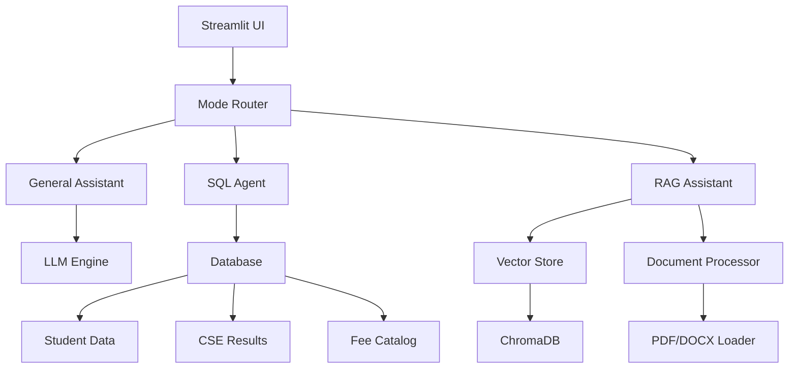

# 🎓 Mentora - University Students Helper

**An AI-powered assistant for academic and administrative queries, built with advanced RAG capabilities and database integration.**


---

## 📋 Table of Contents

- [Overview](#overview)
- [Features](#features)
- [Architecture](#architecture)
- [Installation](#installation)
- [Usage](#usage)
- [File Structure](#file-structure)
- [Database Schema](#database-schema)
- [API Endpoints](#api-endpoints)
- [Configuration](#configuration)
- [Development](#development)
- [Contributing](#contributing)
- [License](#license)

---

## 🚀 Overview

**Mentora** is an intelligent university assistant designed to help students with academic and administrative queries. The project combines multiple AI technologies including Large Language Models (LLMs), Retrieval-Augmented Generation (RAG), and database query agents to provide comprehensive support across three distinct modes of operation.

### Key Capabilities:
- **General AI Assistance** - Answers general academic and university-related questions
- **Database Query Agent** - Intelligent SQL generation for student data retrieval
- **RAG Document Analysis** - Context-aware responses using uploaded documents

---

## ✨ Features

### 🧠 **General Mode**
- General AI assistance using built-in LLM knowledge
- Academic guidance and university information
- No context memory (stateless interactions)

### 🗄️ **Query Mode**
- Natural language to SQL conversion
- Access to multiple university databases:
  - Student records (2021-2023 sessions)
  - CSE results (10-year historical data)
  - Semester fee catalogs
- Intelligent error handling for SQL syntax

### 📚 **RAG Mode**
- Document upload and processing (PDF, DOCX, TXT)
- Context-aware conversations with memory
- Hybrid responses combining document knowledge and AI intelligence
- Vector-based document retrieval

### 🎨 **User Interface**
- Clean, intuitive Streamlit web interface
- Real-time mode switching with visual feedback
- Comprehensive sidebar guidance
- Session management and chat history

---

## 🏗️ Architecture



### Core Components:

1. **LLM Parser** (`llm_parser.py`) - Manages multiple language models
2. **Database Connection** (`database_connection.py`) - Handles SQL operations and logging
3. **Vector Store** (`vector_store.py`) - ChromaDB integration for document embeddings
4. **RAG Loaders** (`rag_loaders.py`) - Document processing and chunking
5. **SQL Agent** (`sql_agent.py`) - Natural language to SQL conversion

---

## 🛠️ Installation

### Quick Setup

1. **Download and Install**
   ```bash
   git clone https://github.com/isfar12/mentora.git
   cd mentora
   pip install -r requirements.txt
   ```

2. **Database Setup**
   ```bash
   # Import database schema and data
   mysql -u root -p < Project/db_creation_command.txt
   ```

3. **Run Application**
   ```bash
   streamlit run Project/streamlit_app.py
   ```

---

## 🚀 Usage

### Running the Application

#### **Streamlit UI (Recommended)**
```bash
streamlit run streamlit_app.py
```
Access the application at `http://localhost:8501`

#### **Manual Operations**
```bash
python main.py
```
For programmatic testing and development

### Using Different Modes

#### 1. **General Mode**
- Default mode for general AI assistance
- Ask any university or academic-related questions
- No document upload required

#### 2. **Query Mode**
- Switch to Query mode using the interface
- Ask natural language questions about student data
- Examples:
  ```
  "Show me all students with CGPA > 3.5 from session 2021"
  "Who are the CSE toppers from the last 5 years?"
  "What's the fee structure for different categories?"
  ```

#### 3. **RAG Mode**
- Upload documents (PDF, DOCX, TXT)
- Click "Process Files" to add to knowledge base
- Ask questions about uploaded content
- Maintains conversation context

---

## 📁 File Structure

```
Mentora/
├── Project/
│   ├── streamlit_app.py          # Main Streamlit UI application
│   ├── main.py                   # Manual operations and testing
│   ├── database_connection.py    # Database operations and logging
│   ├── llm_parser.py            # LLM model configurations
│   ├── prompt_defination.py     # Prompt templates and assistants
│   ├── vector_store.py          # ChromaDB vector operations
│   ├── rag_loaders.py           # Document processing utilities
│   ├── sql_agent.py             # SQL query generation agent
│   ├── context_creation.py      # Session and context management
│   ├── embedding_parser.py      # Text embedding utilities
│   └── Files/                   # Document storage directory
├── Tutorials_References/        # Development tutorials and references
├── Files/                      # Global file storage
└── README.md                   # Project documentation
```

---

## 🗄️ Database Schema

All database tables, schemas, and sample data are available in:
```
Project/db_creation_command.txt
```

This file contains complete SQL commands for:
- **Student Sessions** (2021, 2022, 2023) - Student records with CGPA and hall allocations
- **CSE Results** (10-year historical) - Academic performance and topper information  
- **Semester Fee Catalog** - Fee structure for different categories
- **Application Logs** - System interaction logging
- **Sample Data** - Pre-populated test data for all tables

Simply import this file into your MySQL database to set up the complete schema.

---

## 🔧 Configuration

### Environment Variables (.env)
```env
# Database Configuration
DB_HOST=localhost
DB_PORT=3306
DB_USER=root
DB_PASSWORD=your_password
DB_NAME=universitydb

# LLM Configuration
OLLAMA_HOST=http://localhost:11434
HF_TOKEN=your_huggingface_token

# Vector Store
CHROMA_PERSIST_DIR=vector_store/chroma_vector_store
```

### Model Configuration
The project uses multiple LLM models through Ollama:
- **Gemma 3 270M** - General assistance
- **Gemma 2 2B** - SQL generation
- **Llama 3.2 Latest** - RAG responses

---

## 👨‍💻 Development

### Development Workflow

1. **Manual Testing** (`main.py`)
   ```bash
   python main.py
   ```
   - Test individual components
   - Debug RAG pipeline
   - Validate database connections

2. **UI Development** (`streamlit_app.py`)
   ```bash
   streamlit run streamlit_app.py
   ```
   - Built using **GitHub Copilot** assistance
   - Interactive development and testing
   - Real-time UI feedback

### Key Development Notes

- **GitHub Copilot Integration**: The Streamlit application was developed with significant assistance from GitHub Copilot, enabling rapid UI development and feature implementation
- **Manual Operations**: Core functionality testing and debugging performed through `main.py`
- **Modular Architecture**: Each component is independently testable and maintainable

### Adding New Features

1. **New LLM Models**: Update `llm_parser.py`
2. **Database Tables**: Modify `database_connection.py` and update schema
3. **Document Types**: Extend `rag_loaders.py` with new loaders
4. **UI Components**: Enhance `streamlit_app.py` with new interfaces

---

## 🤝 Contributing

1. **Fork the Repository**
2. **Create Feature Branch**
   ```bash
   git checkout -b feature/amazing-feature
   ```
3. **Commit Changes**
   ```bash
   git commit -m 'Add amazing feature'
   ```
4. **Push to Branch**
   ```bash
   git push origin feature/amazing-feature
   ```
5. **Open Pull Request**

### Development Guidelines
- Follow PEP 8 style guidelines
- Add docstrings to all functions
- Include unit tests for new features
- Update documentation for significant changes

---

## 📊 Performance & Scalability

### Current Capabilities
- **Concurrent Users**: 10-50 (Streamlit limitation)
- **Document Processing**: Up to 100MB per session
- **Database Queries**: Optimized for <1000 records
- **Vector Store**: ChromaDB with efficient similarity search

### Scaling Considerations
- **Database**: Consider PostgreSQL for larger datasets
- **Vector Store**: Pinecone or Weaviate for production
- **UI**: FastAPI + React for enterprise deployment
- **LLM**: Cloud-based models for better performance

---

## 🐛 Troubleshooting

### Common Issues

#### Database Connection Error
```bash
# Check MySQL service
sudo systemctl status mysql
# Verify credentials in .env file
```

#### LLM Model Not Found
```bash
# Install required Ollama models
ollama pull llama3.2:latest
ollama pull gemma2:2b
```

#### Vector Store Permission Error
```bash
# Fix directory permissions
chmod -R 755 vector_store/
```

#### Streamlit Port Conflict
```bash
# Run on different port
streamlit run streamlit_app.py --server.port 8502
```

---

## 📈 Future Roadmap

### Planned Features
-  **Multi-language Support** - Bengali and English interfaces
-  **Advanced Analytics** - Student performance dashboards
-  **Mobile Application** - React Native implementation
-  **API Gateway** - RESTful API for external integrations
-  **Advanced RAG** - Multi-modal document support
-  **Real-time Collaboration** - Shared sessions for group study

### Technical Improvements
-  **Caching Layer** - Redis for improved performance
-  **Monitoring** - Application performance monitoring
-  **Testing** - Comprehensive unit and integration tests
-  **CI/CD Pipeline** - Automated deployment workflows

---

## 📄 License

This project is licensed under the MIT License - see the [LICENSE](LICENSE) file for details.

---

## 🙏 Acknowledgments

- **GitHub Copilot** - For AI-assisted development of the Streamlit interface
- **LangChain Community** - For comprehensive RAG and LLM utilities
- **Streamlit Team** - For the excellent web framework
- **Ollama Project** - For local LLM deployment capabilities
- **ChromaDB** - For efficient vector storage and retrieval

---

## 📞 Contact & Support

- **Developer**: Zubayer Isfar Zeem
- **Email**: [your.email@example.com]
- **GitHub**: [https://github.com/isfar12](https://github.com/isfar12)
- **Issues**: [Project Issues](https://github.com/isfar12/mentora/issues)

---

### 🌟 **Star this repository if you find it helpful!**

---

**Built with ❤️ for university students and academic excellence**
